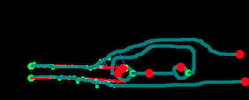

# muscle-plotter (code repository)

## 0. What is muscle-plotter?
Muscle-plotter is an Interactive System based on Electrical Muscle Stimulation (EMS) that produces **spatial output**, it does so by controlling the user's wrist muscles while the user is holding a pen, hence making the pen act as an output plotter. This means that unlike other interactive systems based on EMS which only use poses as output, muscle-plotter is able to: 1) use a spatial reference (the paper) and 2) by drawing the the pen, it is able to persist that data. You can find our paper, video and more information [here](http://hpi.de/baudisch/projects/muscleplotter) (published at ACM UIST'16). 

## 1. What can I do with this repository?

If you are doing research in EMS this might be helpful:

1. You can replicate our user study and our UIST'16 publication;
2. You can remix parts of the code into your project (maybe the control loop, or even the calibration are useful, etc);
3. You can develop new applications for muscle-plotter and submit them via a github pull request, we would love to try anything you build!

## 2. Installing the software and running it

Muscle-plotter is mainly developed in python. To run the next steps and configuring the software, it helps if you are familiar with development in Python. For your simplicity we describe below how to install using a virtual-environment (info [here](http://docs.python-guide.org/en/latest/dev/virtualenvs/)), if you desire to install it system-wide, just skip step 1. Here are the steps for installing: 

0. git clone (cloning muscle-plotter into your machine)
1. virtualenv muscle-env (optional, you can skip to step 5 instead)
3. ``virtualenv -p /usr/bin/python2.7 muscle-env``
4. ``source muscle-env/bin/activate`` 
5. ``pip install -r requirements.txt``

Running muscle plotter:

1. python ``run_demo.py`` (it will ask you which demo to run, you can jump start to a demo by using ``run_demo.py --demo 2` for example to start with wind tunnel simulator)
2. start drawing and muscle-plotter will respond with muscle stimulation.


#### 2.1 A word on dependencies

Most of muscle plotter dependencies can be installed via the command above and are listed in the requirements.txt file. However, we are currently using ``openCV2`` which requires a manual installation. Currently from openCV2 we are using the following function calls for processing an image: ``cv2.dilate()``, ``cv2.threshold()`` and ``cv2.erode()``. 

Furthermore, for testing muscle-plotter without a hardware input device, we recommend installing ``Tkinter`` as required by our ``test/anoto_mouse_emulator.py`` (more information below on the **testing** section).

## 3. Configuring the hardware

The required hardware for muscle plotter is:

1. one Anoto pen (we suggest we-inspire + we-inspire software for Windows)
2. Hasomed's Rehastim EMS stimulator

If you intend to run muscle-plotter with other hardware variations see below how to modify the source code.

### 3.1 using another input method rather than Anoto

Muscle-plotter is agnostic to the input device. In fact, muscle-plotter does not know where the data is coming from. We abstract the hardware by using OSC messages to send the pen coordinates to muscle-pllotter. So, regardless of you are using Anoto or not, you need a client application that sends OSC packets with the X/Y positions to muscle-plotter. 

The OSC messages are formatted as follows:
``/anoto x y event-type timestamp``, where:

* ``/anoto`` is the OSC namespace
* ``x`` is a OSC int with X-position
* ``y`` is a OSC int with Y-position
* ``event-type`` is a OSC string with either ``{down, drag, up}`` These represent pen-down, pen-drag and pen-up actions.
* ``timestamp`` is the time elapsed when message was sent (required for speed calculation)

If you need an example of to implement your own input-hardware into muscle plotter, we suggest reutilizing the code from ``tests/anoto_mouse_emulator.py`` which provides a mouse emulation for muscle-plotter. You can also re-utilize the function ``def send_message(self, point, event='drag', rest=0.012)`` which is essentially all you need.

The OSC communication is setup as follows:

* ``receive_ip: your_local_ip``
* ``receive_port: 5103``

You can change these values in muscle-plotter's ``configuration/defaults.cfg`` (a plain text file with all the configuration values).

### 3.2 using another EMS machine

Muscle-plotter uses Hasomed's Rehastim device (an 8-channel) but with a few changes you can make the implementation hardware-agnostic. If you use any other hardware, we recommend you change the following scripts (found in muscleplotter/modules/ems/):

* ``singlepulse.py`` (instructs your EMS-hardware to generate one single impulse)  
* ``ems_connect.py``assumes your EMS machine is connected via serial and calls ``self.ems.open_port(address, SERIAL_RESPONSE)``, modify accordingly to your hardware. 

### 3.3 calibrating the EMS intensity and duty-cycle

This will depend on your EMS hardware but we know present the how muscle plotter configures a per-user calibration. After you calibrated and found the idea values (see [here](http://hpi.de/baudisch/projects/muscleplotter)) for a suggested calibration procedure) you can edit the file:
1. ``configuration/defaults.cfg`` and indicate the username of your user, e.g.:
``[User]
name: johndoe``
This means muscle-plotter will look for a file named ``johndoe.ems`` in ``configuration/user_parameters``. 
2. edit your username file with the EMS parameters: (here ``configuration/user_parameters/johndoe.ems``):
The ``.ems`` file provides a per-channel calibration of all the EMS intensities. Note that ``amp`` is the amplitude for this user. With the exception of the ``boost`` mode (extra 2mA are applied) muscle plotter uses only the ``pulse-width`` (see [our paper](http://hpi.de/baudisch/projects/muscleplotter) for a complete description of the control loop). 


### 4. Testing & debugging muscle-plotter 

For testing muscle plotter we have included a series of tools:

* ``configuration/defaults.cfg`` (for all configurations). Provides a set of configurations for the muscle-plotter environment: 
  * Username: which .ems file to load
  * EMS machine: disable/enable, serial address, ems period
  * Anoto Server: disable/enable, ip addresses and port, anoto pixel to cm conversion
  * reach Control: latency compensation, look ahead time, brake zone, boost cycles, boost threshold, print stats enable/disable
  * GUI: enable/disable debug image at end of program run
  * Extra EMS channels: disable/enable the brake and up channels
  * User Study Functions: which function file to load

* ``configuration/user_parameters/johndoe.ems`` (for EMS values)


* ``configuration/user_study/`` (when replicating our user study)
Here you will find the following files:
  * ``generate_scripts/generate_user_study_8waves.py`` this generates a set of 8 randomized functions (within certain conditions and sizes of an A4 paper) to be fed as a user study. This prevents the experimenters from knowing the functions or hard-coding them. 
  * ``userstudy8.config`` the function data that will be fed into the study. For this you must invoke muscle-plotter in user study mode (using ``--demo 3``). 


* ``tests/anoto_mouse_emulator.py``
You can invoke muscle-plotter with ``python run_demo.py --mouse``, the addition of ``--mouse`` will automatically start a thread with another python instance that shows a mouse emulator. This allows you to control muscle plotter using your mouse cursor instead of an Anoto pen. 


* ``output`` folder. (for wind tunnel simulation)
If you look under the ``output`` folder you will find a few debug images that provide further information of the status of the wind tunnel stimulation. Note that these files are generetaed at every run, so if you want to keep your folder clean for the next run you can invoke muscle-plotter with the ```--remove`` argument (or ``-r`` for short) which will remove all files in ``output`` prior to running the application. In the ``output`` folder you can find the following debug images:

  * ``streamplot.png``: this is a stream plot of the wind lines passing through your sketch (rendered using matplotlib's streamplot).


  * ``custom_strealimes.png``: our customized streamline plotter, demonstrating N-streamlines passing through your sketch at regular Y intervals:


  * ``realtime_simulation.mp4``: a movie (animated frames) of the wind flowing through your shape. (rendered with matplotlib's animation)


* Image output, when closing.

Anytime you close muscle-plotter (e.g., by control+c) it will display a image with all the data from the current run (this can be cluttered if you do a long session). 



In this image: green is a pen down, red is pen up, red lines are target traces, turquoise lines are user sketches, blue segments are distances to target as calculated by the control loop. This is extremely useful for debugging purposes. If you get tired of this, turn it off in ``configuration/defaults.cfg`` by setting ``display_debug_image_at_end: True`` to ``False`` instead. 


### 5. What is not included here?

We did not include our custom Anoto (we'inspire) OSC server (protected via We'inspire License). We did not include the custom Tesseract binding since it adds immensely to the complexity of the repository (and its dependencies). Contact us if you want to integrate Tesseract on your muscle-plotter.

### 6. An Introduction to the Code Structure

Muscle-plotter applications consist of a single 'Plotter' class instance serving a single dispatcher at a given time based on the context on the paper from a list of many possible dispatchers.

#### Plotter
Plotter object is responsible of starting the input and output (anoto and ems) connections on initialization. Later, it creates a reach model (an EMS control loop) instance whenever a muscle-plotting (EMS) action takes place.

the ``plotter`` manages:

 * [ EMS connection, Anoto Pen connection ]
 * [ dispatcher(active), dispatcher, dispatchers... ]

##### On Start:
1.  Anoto Pen Connection:
   ``Plotter`` class initializes anotoconnect that runs an OSC Thread. ``anotoconnect`` gets series of callback functions that determine the behavior of the dispatchers.
2.  EMS Connection:
    as detailed in hardware section this connects via serial port

#### Dispatchers
Dispatchers provide the parameters to the plotter. These parameters specify the location and additional configurations. Location is handled with a ``Canvas`` object, that helps arranging transformations.
Each plotter has a single dispatcher associated with it at a given time. The active function to be served by ``Plotter`` is controlled by assigning another active dispatcher to the plotter.

# Authors & more info
Muscle-plotter is a work by [Pedro Lopes](http://plopes.org), [Doga Yueksel](https://dogayuksel.com/) and [Patrick Baudisch](http://www.patrickbaudisch.com/) (at the [Hasso Plattner Insititute](http://hpi.de).) You can find the paper, video and more information [here](http://hpi.de/baudisch/projects/muscleplotter)). 

## credited code

The wind tunnel simulation is derived from the Lattice Boltzmann solver found at http://physics.weber.edu/schroeder/fluids (credits remain with original authors). 
